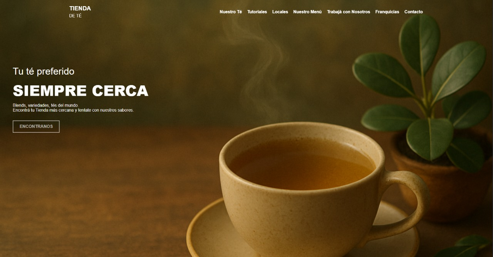

# Proyecto Grupal: "Tea Harmony" - Clonación y Adaptación Web

## Descripción del Proyecto

Este proyecto fue desarrollado como parte del Trabajo Práctico Obligatorio N°1 Grupal para la materia **Front-End** del IFTS Nº29.

El objetivo principal fue tomar como base el diseño y la estructura de una página web existente de venta de cafés dada por el doncente y realizar una **clonación adaptada** para crear "Tea Harmony", una tienda online ficticia especializada en la venta de tés e infusiones.

A través de este ejercicio, se buscó aplicar los conocimientos adquiridos en maquetación web con HTML5, estilización con CSS3, y principios de diseño responsivo para lograr una experiencia de usuario agradable y funcional.



## 🚀 Demo en Vivo

Puedes ver una demostración en vivo del sitio aquí:
[Enlace a la demo en GitHub Pages](https://marianohlopez.github.io/ifts-frontend-tpo1/)

## 👥 Integrantes del Grupo

*   Mariano Lopez ([@marianohlopez](https://github.com/marianohlopez))
*   Facundo Villarreal ([@facundovillarreal](https://github.com/facu041294))
*   Ernesto Pisano ([@ernestopisano](https://github.com/espisano))

## ✨ Características Implementadas

*   **Adaptación Temática:** Transformación del concepto original de "café" a "té", modificando contenido, imágenes y paleta de colores para reflejar la nueva temática.
*   **Estructura de Página Completa:** Incluye secciones como:
    *   Inicio (Hero section)
    *   Nuestros Productos (Variedades de té)
    *   Tutoriales
    *   Nuestro menú
    *   Contacto
    *   Franquicias
    *   Trabaja con nosotros
*   **Diseño Responsivo:** El sitio se adapta a diferentes tamaños de pantalla (desktop, tablets y móviles) utilizando CSS Flexbox, Grid y Media Queries.
*   **Maquetación Semántica:** Uso de HTML5 para una estructura clara y accesible.
*   **Estilización Personalizada:** Aplicación de estilos CSS para lograr la estética de "Tea Harmony".
*   **Navegación Intuitiva:** Menú de navegación funcional y enlaces internos.

## 🛠️ Tecnologías Utilizadas

*   **HTML5:** Para la estructura semántica del contenido.
*   **CSS3:** Para el diseño, layout y la presentación visual.
    *   Flexbox
    *   CSS Grid 
    *   Media Queries para responsividad
    *   Variables CSS 
*   **Git y GitHub:** Para el control de versiones y la colaboración en el proyecto.
*   **JavaScript (Vanilla):** Si se utilizó para alguna funcionalidad menor.

## 📂 Estructura del Proyecto 

La estructura del repositorio sigue una organización estándar para proyectos web front-end:

*   ifts-frontend-tpo1/
*   ├── css/
*   │ └── base.css # Hoja de estilos principal
*   │ └── contacto.css
*   │ └── franquicias.css
*   │ └── index.css
*   │ └── menu-tienda.css
*   │ └── tienda.css
*   │ └── trabaja-en-tdt.css
*   │ └── tutoriales.css
*   ├── img/ # Carpeta para imágenes utilizadas
*   │ ├── index/
*   │ │ └── home-backgound.png
*   │ │ └── ...
*   │ ├── menu-tienda/
*   │ ├── tienda/
*   │ └── ...
*   ├── js/
*   │ ├── main.js
*   ├── index.html # Página principal
*   ├── contacto.html
*   ├── franquicias.html
*   ├── menu-tienda.html
*   ├── tienda.html
*   ├── trabaja-en-tdt.html
*   ├── tutoriales.html
*   └── README.md # Este archivo

## 📝 Proceso de Adaptación

1.  **Análisis del Sitio Original:** Estudio de la estructura, layout, componentes y funcionalidades del sitio de referencia.
2.  **Definición de la Nueva Temática:** Establecimiento de la identidad visual y de contenido para "Tea Harmony".
3.  **Planificación de Cambios:** Identificación de secciones a modificar, nuevo contenido textual y gráfico.
4.  **Desarrollo HTML y CSS:** Maquetación de las diferentes páginas y aplicación de los nuevos estilos.
5.  **Implementación de Responsividad:** Asegurar la correcta visualización en diversos dispositivos.
6.  **Revisión y Ajustes:** Pruebas y correcciones para pulir el resultado final.

## 🚀 Cómo Ejecutar Localmente

1.  Clona este repositorio en tu máquina local:
    ```bash
    git clone https://github.com/marianohlopez/ifts-frontend-tpo1.git
    ```
2.  Navega a la carpeta del proyecto:
    ```bash
    cd ifts-frontend-tpo1
    ```
3.  Abre el archivo `index.html` en tu navegador web preferido.

---

Este proyecto representa nuestro esfuerzo colaborativo y la aplicación práctica de las herramientas y conceptos de desarrollo front-end aprendidos en la cursada.